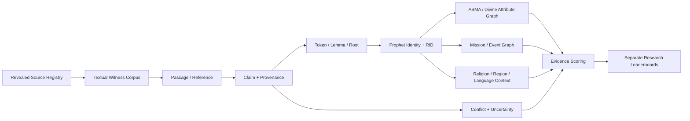
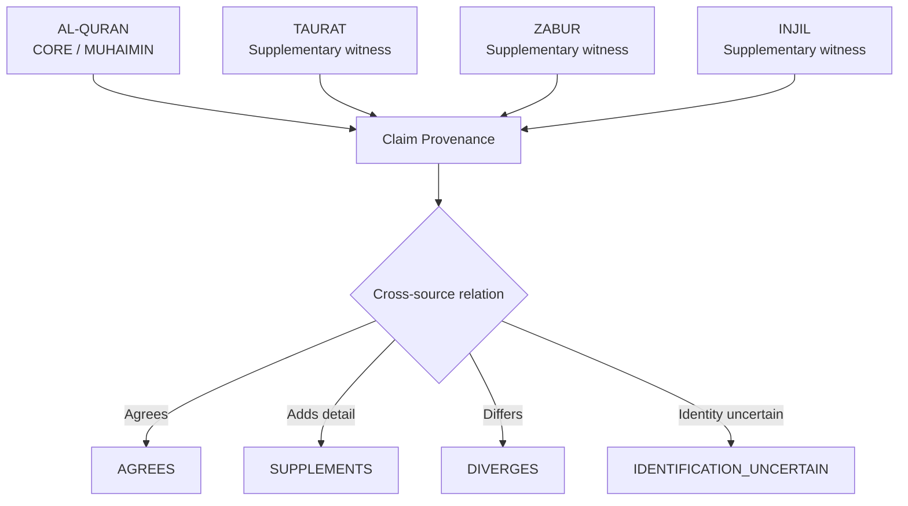
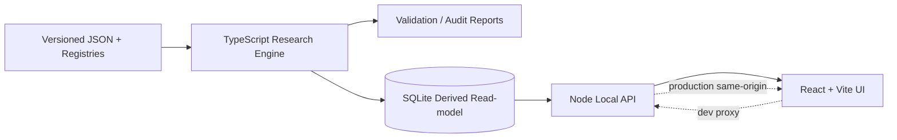
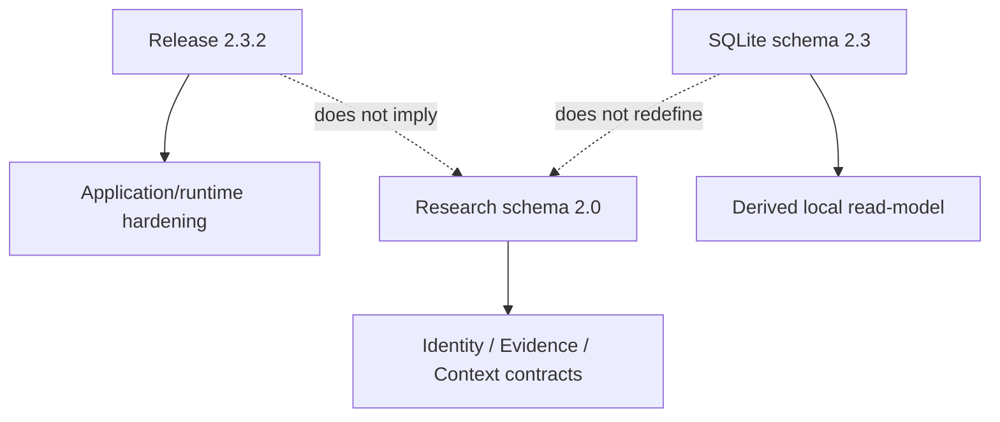

# Architecture Diagrams v2.3

## Research flow

```mermaid
flowchart LR
  A[Revealed Source Registry] --> B[Textual Witness Corpus]
  B --> C[Passage / Reference]
  C --> D[Claim + Provenance]
  D --> E[Token / Lemma / Root]
  E --> F[Prophet Identity + RID]
  F --> G[ASMA / Divine Attribute Graph]
  F --> H[Mission / Event Graph]
  F --> I[Religion / Region / Language Context]
  D --> J[Conflict + Uncertainty]
  G --> K[Evidence Scoring]
  H --> K
  I --> K
  J --> K
  K --> L[Separate Research Leaderboards]
```

## Four-corpus source flow

```mermaid
flowchart TD
  Q[AL-QURAN\nCORE / MUHAIMIN] --> P[Claim Provenance]
  T[TAURAT\nSupplementary witness] --> P
  Z[ZABUR\nSupplementary witness] --> P
  I[INJIL\nSupplementary witness] --> P
  P --> C{Cross-source relation}
  C -->|Agrees| A[AGREES]
  C -->|Adds detail| S[SUPPLEMENTS]
  C -->|Differs| D[DIVERGES]
  C -->|Identity uncertain| U[IDENTIFICATION_UNCERTAIN]
```

## Runtime flow

```mermaid
flowchart LR
  J[Versioned JSON + Registries] --> TS[TypeScript Research Engine]
  TS --> V[Validation / Audit Reports]
  TS --> DB[(SQLite Derived Read-model)]
  DB --> API[Node Local API]
  API --> R[React + Vite UI]
  R -. dev proxy .-> API
  API -. production same-origin .-> R
```

## Version boundaries

```mermaid
flowchart TD
  RV[Release 2.3.2] --> APP[Application/runtime hardening]
  DS[Research schema 2.0] --> MODEL[Identity / Evidence / Context contracts]
  DB[SQLite schema 2.3] --> READ[Derived local read-model]
  RV -. does not imply .-> DS
  DB -. does not redefine .-> DS
```
